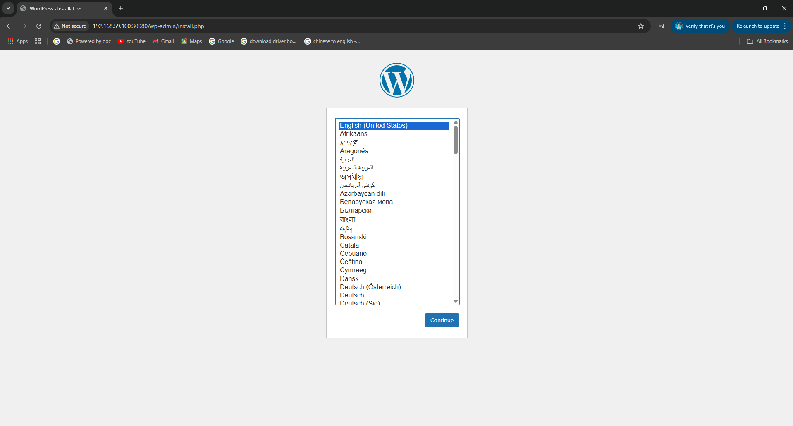
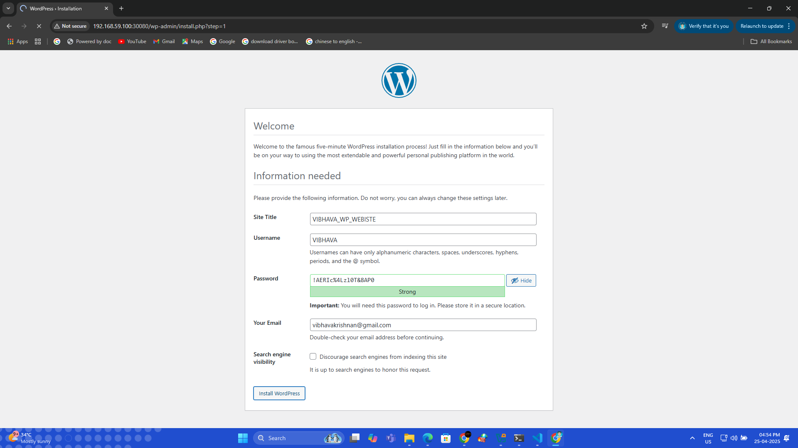

# WordPress on Kubernetes

This project deploys a WordPress site with MySQL backend on Kubernetes using persistent volumes and secrets.

## Features

- WordPress + MySQL on Kubernetes
- Persistent storage for both WordPress and MySQL
- Kubernetes Secrets for secure credentials
- NodePort service for WordPress access
- One-step deployment using `kustomize`

## Screenshots




## How to Use

You can apply all the resources at once using `kustomize`:

```bash
kubectl apply -k .
```

> Make sure you are in the project directory and have `kubectl` and `kustomize` installed.

Access WordPress using your cluster IP or NodePort IP.
